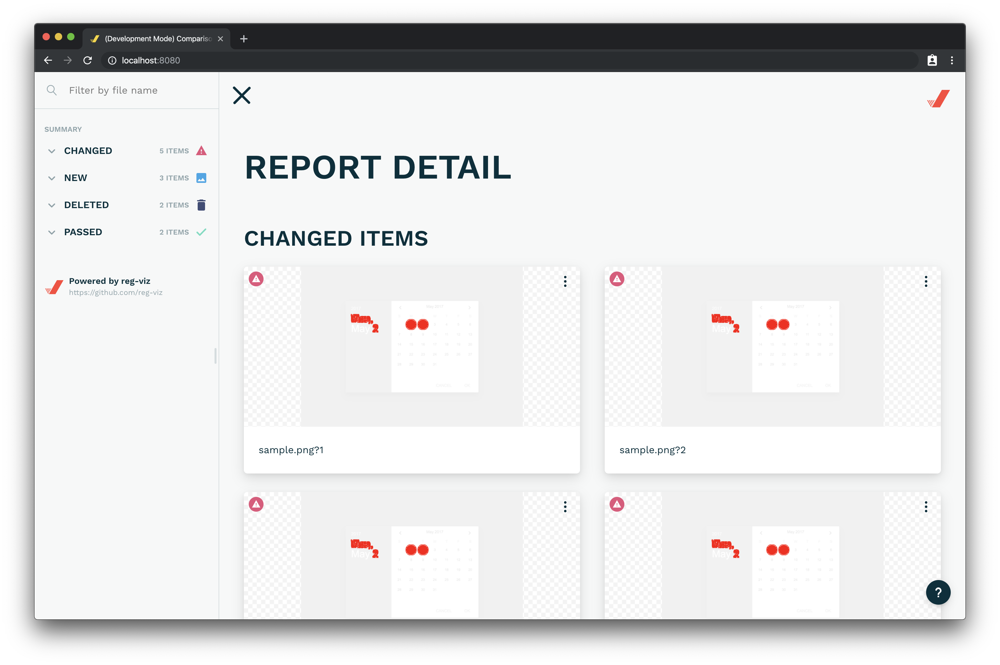
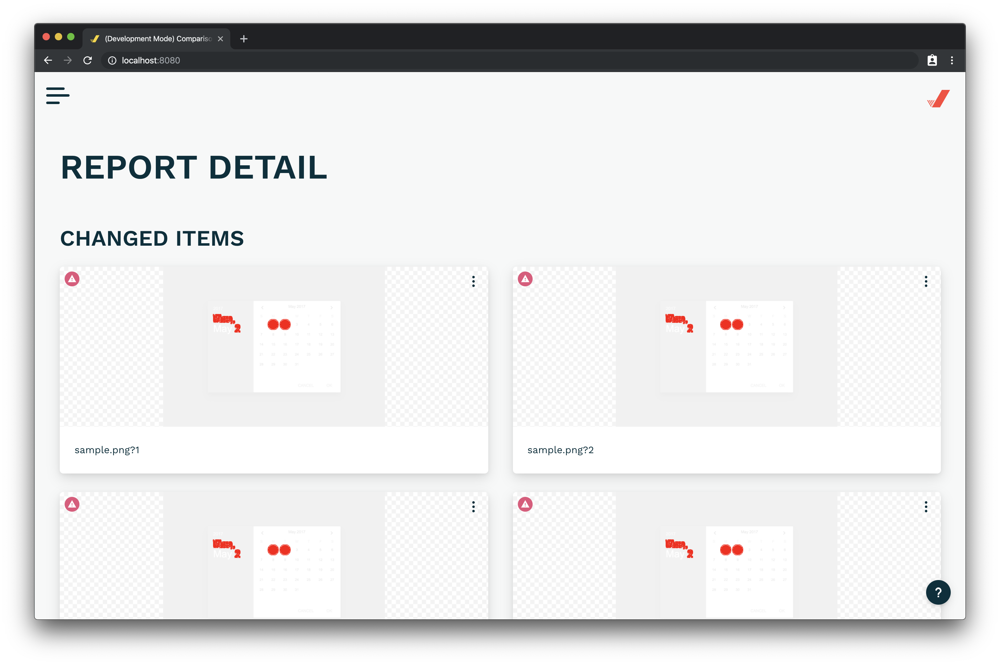
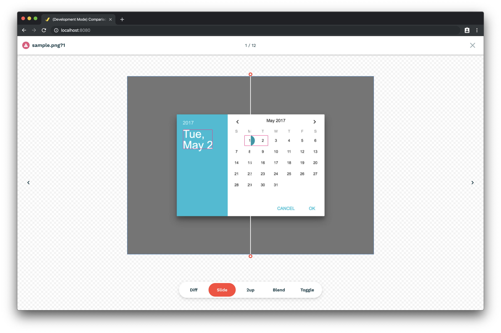

# art-graph-suit-report-ui

> 显示图片差异报告界面，主要用于显示 art-graph 引擎的测试报告, 基于[reg-viz/reg-cli-report-ui](https://github.com/reg-viz/)仓库修改，增加了更新快照功能

## Screenshots





## Available scripts

The following list is scripts used during development.

### `yarn start`

```bash
$ yarn start
```

Launch the Report UI with the mock data.

### `yarn build`

```bash
$ yarn build
```

Generate the JavaScript file required to embed Report UI. This is usually called in [art-graph/visual-test-api](https://github.com/art-graph/visual-test-api).

### `yarn typecheck`

```bash
$ yarn typecheck
```

Run static type checking using TypeScript.

### `yarn lint`

```bash
$ yarn lint
```

Run Lint with ESLint.

### `yarn format`

```bash
$ yarn format
```

Format the source code using Prettier and ESLint.

### `yarn storybook`

```bash
$ yarn storybook
```

Launch the component catalog with Storybook.

### `yarn scaffold`

```bash
$ yarn scaffold
```

Generate a component template.
